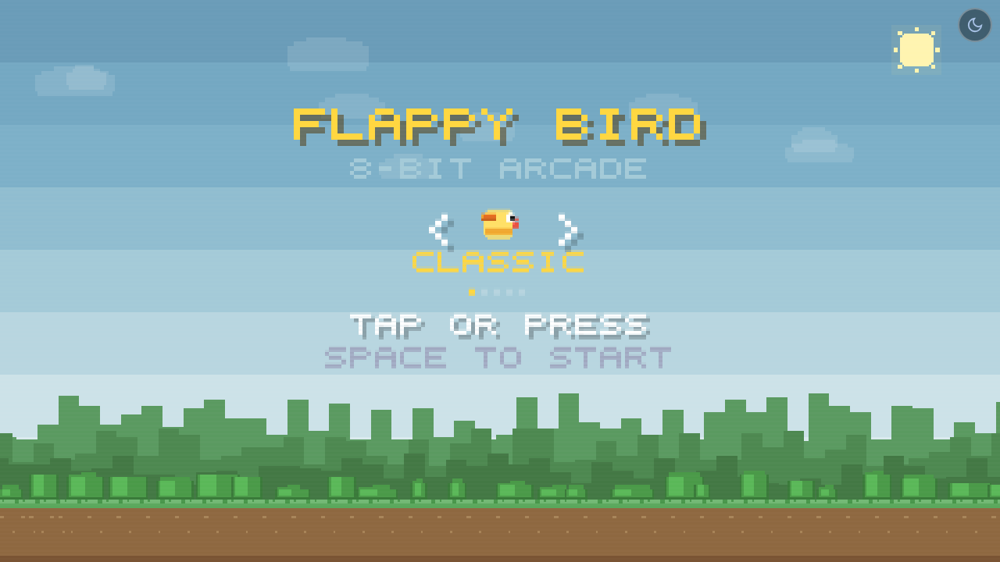
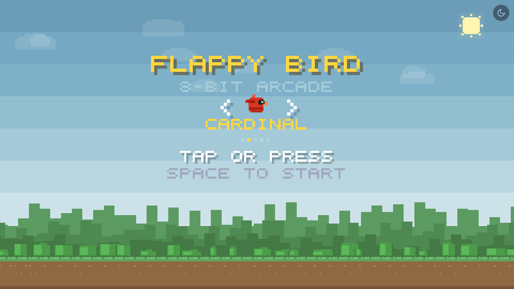
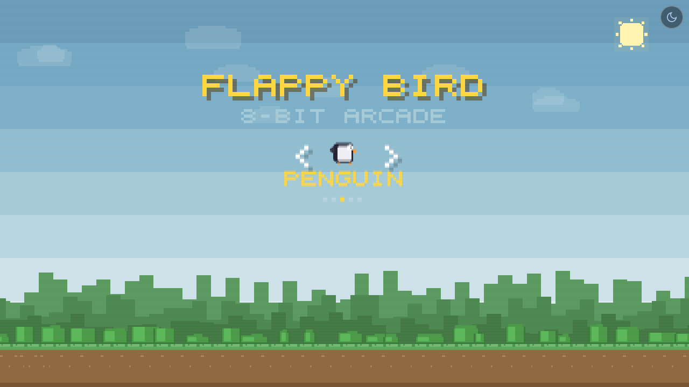
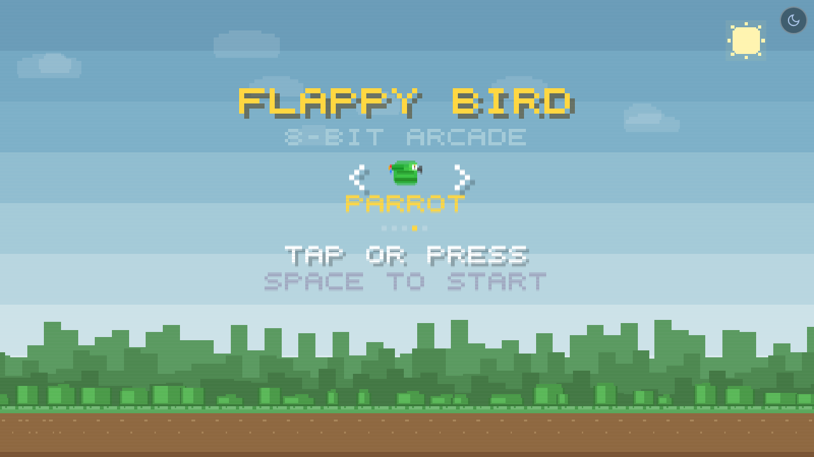
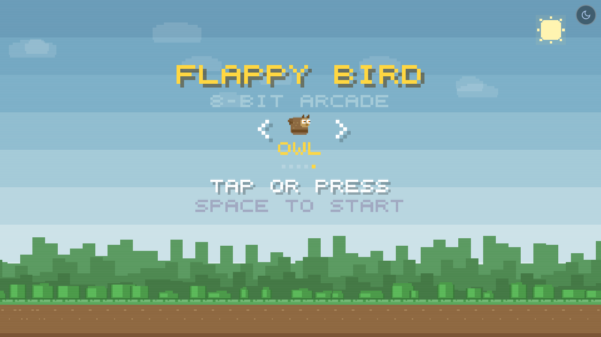
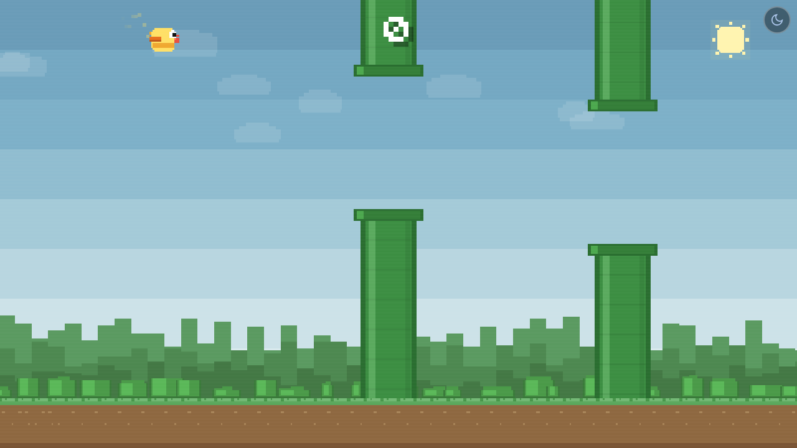
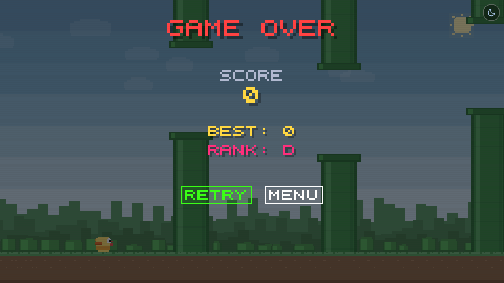
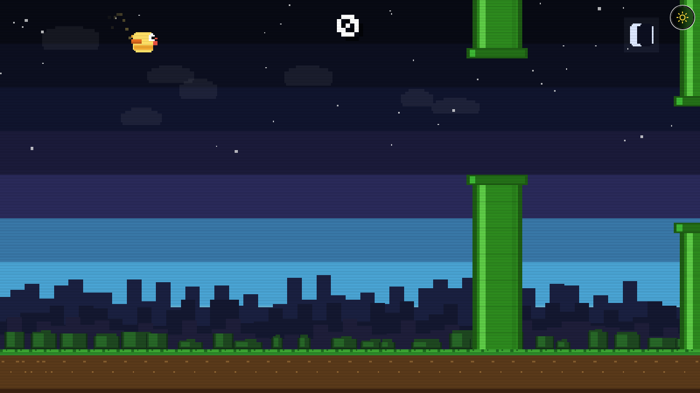

# Flappy Bird -- 8-Bit Arcade Edition

A retro-styled Flappy Bird clone built entirely with vanilla HTML, CSS, and JavaScript. The game runs in any modern browser with no external dependencies, frameworks, or build tools required. Everything lives in a single self-contained HTML file.

---

## Description

This is a browser-based arcade game inspired by the original Flappy Bird. The player controls a pixel-art bird that must navigate through an endless series of pipes by tapping or pressing a key to flap. The game features hand-drawn pixel-art characters, synthesized 8-bit sound effects, and adaptive layouts that work across desktop monitors and mobile phones.

The project was built as a single-file web application to demonstrate what can be achieved with the HTML5 Canvas API, the Web Audio API, and plain JavaScript -- no libraries, no bundlers, no package managers.

---

## Features

- **5 Playable Characters** -- Choose from five uniquely designed pixel-art birds, each with distinct textures, features, and silhouettes: Classic (yellow canary), Cardinal (red with crest and face mask), Penguin (black and white with flippers), Parrot (green with striped chest and rainbow tail), and Owl (brown with ear tufts and spotted chest).

- **Retro Pixel-Art Visuals** -- Custom 5x5 bitmap font, hand-coded sprites, parallax scrolling backgrounds, animated bushes, clouds, sun/moon, and ground textures. All graphics are drawn programmatically using `fillRect` calls on a canvas.

- **Day and Night Mode** -- A toggle button switches between a bright daytime palette and a dark nighttime palette with twinkling stars and a crescent moon. The transition is smooth (colors interpolate across frames). The user's preference is saved to `localStorage` and restored on reload.

- **Adaptive Resolution** -- The game detects screen orientation and switches between a landscape layout (480x270, optimized for desktop) and a portrait layout (216x384, optimized for phones). All game constants are tuned separately for each mode.

- **Mobile Support** -- Touch input is fully supported. The viewport is locked to prevent pinch-zoom and pull-to-refresh. A touch guard prevents the common mobile bug where `touchstart` and `click` both fire from a single tap.

- **Delta-Time Physics** -- Game speed is consistent across all devices regardless of frame rate. A 30fps preview and a 144fps monitor run at the exact same perceived speed.

- **8-Bit Sound Effects** -- Jump chirps, score dings, collision noise, character select clicks, and a game-over melody are all synthesized at runtime using the Web Audio API with square-wave oscillators. No audio files are loaded.

- **Score Tracking and Rank System** -- The current score is displayed during gameplay. The best score is persisted to `localStorage`. After each game, the player receives a letter rank (S, A, B, C, or D) based on their score.

- **Menu and Retry Buttons** -- The game over screen includes a RETRY button to immediately restart and a MENU button to return to the start screen and change characters.

- **Screen Shake and Particle Trail** -- A camera shake effect fires on collision. Golden particles trail behind the bird during flight, matching the selected character's color.

---

## Demo

Play the game here: [https://harrynoble.github.io/flappy-bird/](https://harrynoble.github.io/flappy-bird/)

---

## Screenshots

### Start Screen -- Character Select



### Playable Characters

| Cardinal | Penguin | Parrot | Owl |
|----------|---------|--------|-----|
|  |  |  |  |

### Gameplay (Day Mode)



### Game Over



### Night Mode



---

## Controls

| Platform | Action              | Input                        |
|----------|---------------------|------------------------------|
| Desktop  | Flap / Jump         | `Spacebar` or `Arrow Up`     |
| Desktop  | Flap / Jump         | Left-click anywhere          |
| Desktop  | Change Character    | `Arrow Left` / `Arrow Right` |
| Mobile   | Flap / Jump         | Tap anywhere on screen       |
| Mobile   | Change Character    | Tap the `<` `>` arrows       |
| Any      | Toggle Theme        | Click/tap the icon (top-right corner) |
| Any      | Retry After Death   | Click RETRY or press Space   |
| Any      | Return to Menu      | Click MENU button            |

---

## Technologies Used

| Technology             | Purpose                                      |
|------------------------|----------------------------------------------|
| HTML5                  | Document structure, single-file container     |
| CSS                    | Canvas positioning, theme button styling      |
| JavaScript (ES6+)     | All game logic, rendering, input handling     |
| Canvas API             | 2D rendering of all sprites, backgrounds, UI  |
| Web Audio API          | Runtime synthesis of 8-bit sound effects      |
| localStorage           | Persisting best score, theme, and character   |

No external libraries, frameworks, CDNs, or images are used.

---

## How to Run

1. **Clone** the repository:

   ```bash
   git clone https://github.com/harrynoble/flappy-bird.git
   cd flappy-bird
   ```

2. **Open** the game in any modern browser:

   ```bash
   open index.html
   ```

   Or simply double-click `index.html` in your file manager.

3. **Play.** No server, no build step, no installation required.

> **Note:** Audio requires a user interaction (click or tap) before the browser will allow sound playback. This is handled automatically on the first flap.

---

## Project Structure

```
flappy-bird/
    index.html                            # The entire game in one file
    README.md                             # This file
    LICENSE                               # MIT License
    screenshots/
        start-screen-desktop.png          # Start screen with Classic bird
        start-cardinal.png                # Cardinal character selected
        start-penguin.png                 # Penguin character selected
        start-parrot.png                  # Parrot character selected
        start-owl.png                     # Owl character selected
        gameplay-desktop.png              # Active gameplay with pipes
        game-over-desktop.png             # Game over with RETRY and MENU buttons
        night-mode-desktop.png            # Gameplay in night mode
```

### Code Organization (inside index.html)

| Section                | Description                                        |
|------------------------|----------------------------------------------------|
| Adaptive Resolution    | Detects portrait vs landscape, sets game constants  |
| Bird Characters        | 5 unique draw functions with distinct pixel-art     |
| Palettes               | Day and night color definitions, interpolation      |
| Pixel Font             | 5x5 bitmap glyph definitions and text renderer      |
| Audio Engine           | Web Audio synthesis for all sound effects            |
| Game State             | Physics, pipes, collision, scoring                   |
| Input System           | Keyboard, mouse, touch with button hit detection     |
| Screens                | Start (with character carousel), game over (with buttons) |
| Main Loop              | Delta-time `requestAnimationFrame` loop              |

---

## Character Guide

| Character | Visual Features |
|-----------|----------------|
| **Classic** | Yellow canary with orange belly, red beak, and orange wing |
| **Cardinal** | Red body with pointed crest, black face mask, thick orange beak, long tail feathers |
| **Penguin** | Black and white body, large white belly, stubby flippers instead of wings, orange feet |
| **Parrot** | Green body with striped chest bands, hooked dark beak, golden iris, rainbow tail (red/orange/blue) |
| **Owl** | Brown body with ear tufts, lighter face disc, two large eyes with orange irises, spotted chest pattern |

---

## Future Improvements

- **Difficulty Progression** -- Gradually increase pipe speed as the score climbs using asymptotic curves.
- **Leaderboard** -- Store top scores with player initials using `localStorage` or a backend.
- **Additional Themes** -- Sunset, underwater, space, or seasonal palettes.
- **Power-Ups** -- Temporary slow-motion, shield, or score multiplier items.
- **Pause Menu** -- Allow pausing mid-game with a resume option.
- **PWA Support** -- Service worker and manifest for installable mobile app.

---

## Author

**Harry Noble**

- GitHub: [github.com/harrynoble](https://github.com/harrynoble)

---

## License

This project is licensed under the **MIT License**.

```
MIT License

Copyright (c) 2025 Harry Noble

Permission is hereby granted, free of charge, to any person obtaining a copy
of this software and associated documentation files (the "Software"), to deal
in the Software without restriction, including without limitation the rights
to use, copy, modify, merge, publish, distribute, sublicense, and/or sell
copies of the Software, and to permit persons to whom the Software is
furnished to do so, subject to the following conditions:

The above copyright notice and this permission notice shall be included in all
copies or substantial portions of the Software.

THE SOFTWARE IS PROVIDED "AS IS", WITHOUT WARRANTY OF ANY KIND, EXPRESS OR
IMPLIED, INCLUDING BUT NOT LIMITED TO THE WARRANTIES OF MERCHANTABILITY,
FITNESS FOR A PARTICULAR PURPOSE AND NONINFRINGEMENT. IN NO EVENT SHALL THE
AUTHORS OR COPYRIGHT HOLDERS BE LIABLE FOR ANY CLAIM, DAMAGES OR OTHER
LIABILITY, WHETHER IN AN ACTION OF CONTRACT, TORT OR OTHERWISE, ARISING FROM,
OUT OF OR IN CONNECTION WITH THE SOFTWARE OR THE USE OR OTHER DEALINGS IN THE
SOFTWARE.
```

---

Built with plain HTML, CSS, and JavaScript. No dependencies. Just open and play.
